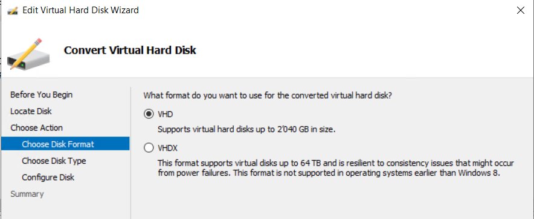
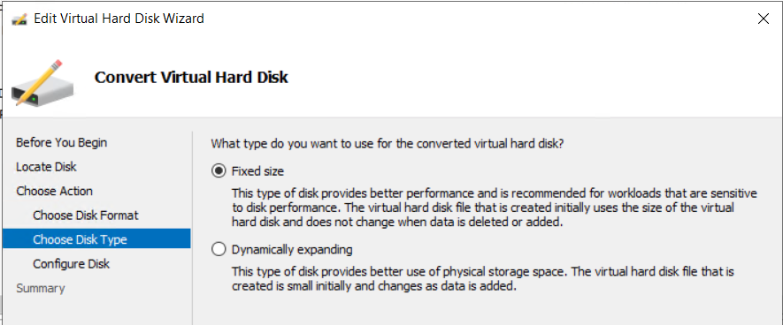
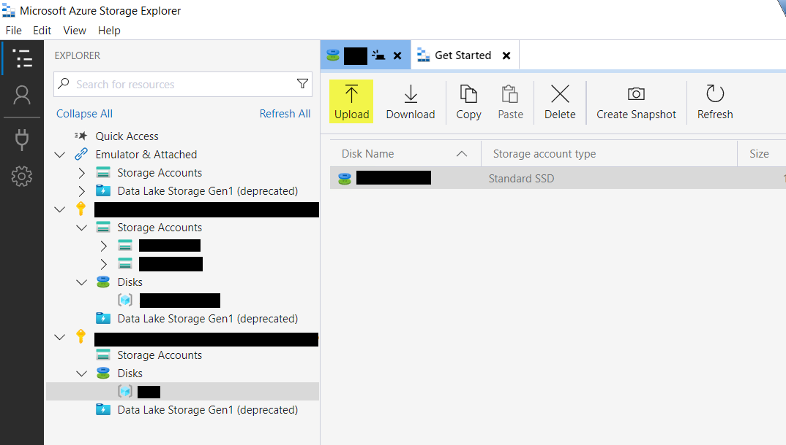
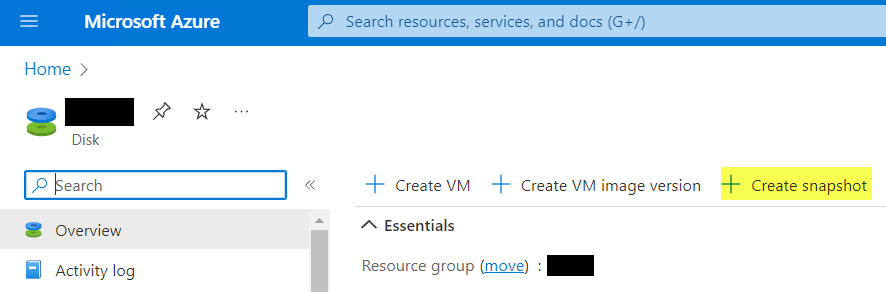
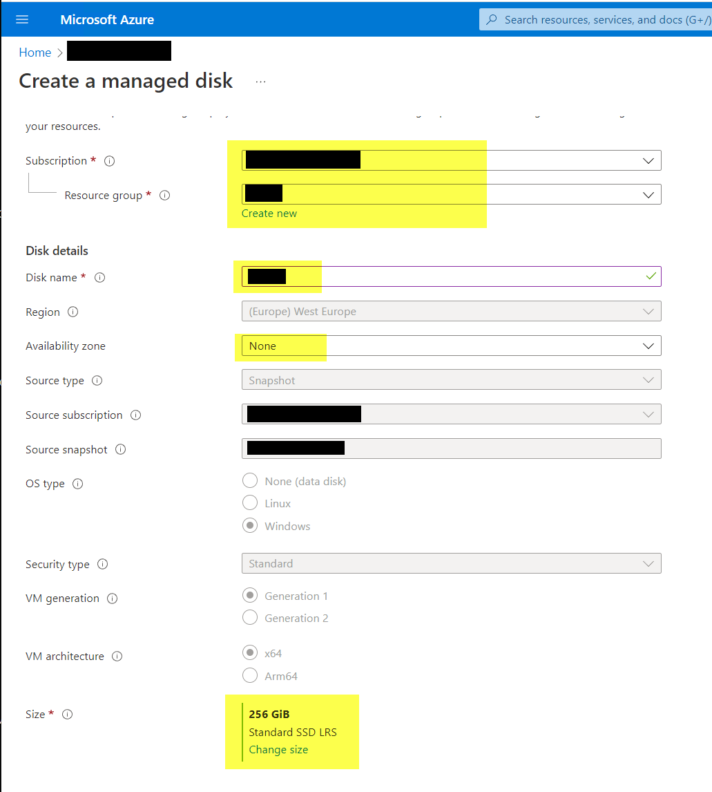
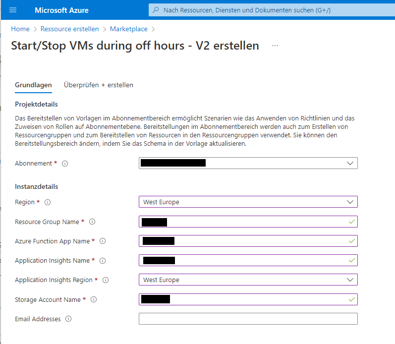
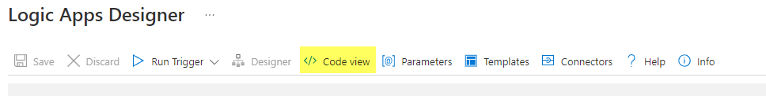

# Kusi's Knowledge Base

## Hyper-V VM to Azure

### Convert VM with Hyper-V Manager

Open Hyper-V Manager

Navigate to Actions / Edit Disk...


Convert


VHD



Fixed size



### Prepare VM

[based on Microsoft Article](https://learn.microsoft.com/en-us/azure/virtual-machines/windows/prepare-for-upload-vhd-image)

Start the VM and install all Windows Updates and reboot

After reboot start PowerShell:

In Cmd:

```cmd
sfc.exe /scannow

diskpart.exe
san policy=onlineall
exit
```

```powershell
netsh.exe winhttp reset proxy

Set-ItemProperty -Path HKLM:\SYSTEM\CurrentControlSet\Control\TimeZoneInformation -Name RealTimeIsUniversal -Value 1 -Type DWord -Force
Set-Service -Name w32time -StartupType Automatic

powercfg.exe /setactive SCHEME_MIN
powercfg /setacvalueindex SCHEME_CURRENT SUB_VIDEO VIDEOIDLE 0

Set-ItemProperty -Path 'HKLM:\SYSTEM\CurrentControlSet\Control\Session Manager\Environment' -Name TEMP -Value "%SystemRoot%\TEMP" -Type ExpandString -Force
Set-ItemProperty -Path 'HKLM:\SYSTEM\CurrentControlSet\Control\Session Manager\Environment' -Name TMP -Value "%SystemRoot%\TEMP" -Type ExpandString -Force

Get-Service -Name BFE, Dhcp, Dnscache, IKEEXT, iphlpsvc, nsi, mpssvc, RemoteRegistry | Where-Object StartType -ne Automatic | Set-Service -StartupType Automatic

Get-Service -Name Netlogon, Netman, TermService | Where-Object StartType -ne Manual | Set-Service -StartupType Manual

Set-ItemProperty -Path 'HKLM:\SYSTEM\CurrentControlSet\Control\Terminal Server' -Name fDenyTSConnections -Value 0 -Type DWord -Force
Set-ItemProperty -Path 'HKLM:\SOFTWARE\Policies\Microsoft\Windows NT\Terminal Services' -Name fDenyTSConnections -Value 0 -Type DWord -Force

Set-ItemProperty -Path 'HKLM:\SYSTEM\CurrentControlSet\Control\Terminal Server\Winstations\RDP-Tcp' -Name PortNumber -Value 3389 -Type DWord -Force

Set-ItemProperty -Path 'HKLM:\SYSTEM\CurrentControlSet\Control\Terminal Server\Winstations\RDP-Tcp' -Name LanAdapter -Value 0 -Type DWord -Force

Set-ItemProperty -Path 'HKLM:\SYSTEM\CurrentControlSet\Control\Terminal Server\WinStations\RDP-Tcp' -Name UserAuthentication -Value 1 -Type DWord -Force

Set-ItemProperty -Path 'HKLM:\SOFTWARE\Policies\Microsoft\Windows NT\Terminal Services' -Name KeepAliveEnable -Value 1  -Type DWord -Force
Set-ItemProperty -Path 'HKLM:\SOFTWARE\Policies\Microsoft\Windows NT\Terminal Services' -Name KeepAliveInterval -Value 1  -Type DWord -Force
Set-ItemProperty -Path 'HKLM:\SYSTEM\CurrentControlSet\Control\Terminal Server\Winstations\RDP-Tcp' -Name KeepAliveTimeout -Value 1 -Type DWord -Force

Set-ItemProperty -Path 'HKLM:\SOFTWARE\Policies\Microsoft\Windows NT\Terminal Services' -Name fDisableAutoReconnect -Value 0 -Type DWord -Force
Set-ItemProperty -Path 'HKLM:\SYSTEM\CurrentControlSet\Control\Terminal Server\Winstations\RDP-Tcp' -Name fInheritReconnectSame -Value 1 -Type DWord -Force
Set-ItemProperty -Path 'HKLM:\SYSTEM\CurrentControlSet\Control\Terminal Server\Winstations\RDP-Tcp' -Name fReconnectSame -Value 0 -Type DWord -Force

Set-ItemProperty -Path 'HKLM:\SYSTEM\CurrentControlSet\Control\Terminal Server\Winstations\RDP-Tcp' -Name MaxInstanceCount -Value 4294967295 -Type DWord -Force

if ((Get-Item -Path 'HKLM:\SYSTEM\CurrentControlSet\Control\Terminal Server\WinStations\RDP-Tcp').Property -contains 'SSLCertificateSHA1Hash')
{
    Remove-ItemProperty -Path 'HKLM:\SYSTEM\CurrentControlSet\Control\Terminal Server\WinStations\RDP-Tcp' -Name SSLCertificateSHA1Hash -Force
}

Set-NetFirewallProfile -Profile Domain, Public, Private -Enabled True

Enable-PSRemoting -Force
Set-NetFirewallRule -Name WINRM-HTTP-In-TCP, WINRM-HTTP-In-TCP-PUBLIC -Enabled True

Set-NetFirewallRule -Group '@FirewallAPI.dll,-28752' -Enabled True

Set-NetFirewallRule -Name FPS-ICMP4-ERQ-In -Enabled True

New-NetFirewallRule -DisplayName AzurePlatform -Direction Inbound -RemoteAddress 168.63.129.16 -Profile Any -Action Allow -EdgeTraversalPolicy Allow
New-NetFirewallRule -DisplayName AzurePlatform -Direction Outbound -RemoteAddress 168.63.129.16 -Profile Any -Action Allow

chkdsk.exe /f
```

Reboot VM

In Cmd:

```cmd
bcdedit.exe /set "{bootmgr}" integrityservices enable
bcdedit.exe /set "{default}" device partition=C:
bcdedit.exe /set "{default}" integrityservices enable
bcdedit.exe /set "{default}" recoveryenabled Off
bcdedit.exe /set "{default}" osdevice partition=C:
bcdedit.exe /set "{default}" bootstatuspolicy IgnoreAllFailures
bcdedit.exe /set "{bootmgr}" displaybootmenu yes
bcdedit.exe /set "{bootmgr}" timeout 5
bcdedit.exe /set "{bootmgr}" bootems yes
bcdedit.exe /ems "{current}" ON
bcdedit.exe /emssettings EMSPORT:1 EMSBAUDRATE:115200
```

In PowerShell:

```powershell
Set-ItemProperty -Path 'HKLM:\SYSTEM\CurrentControlSet\Control\CrashControl' -Name CrashDumpEnabled -Type DWord -Force -Value 2
Set-ItemProperty -Path 'HKLM:\SYSTEM\CurrentControlSet\Control\CrashControl' -Name DumpFile -Type ExpandString -Force -Value "%SystemRoot%\MEMORY.DMP"
Set-ItemProperty -Path 'HKLM:\SYSTEM\CurrentControlSet\Control\CrashControl' -Name NMICrashDump -Type DWord -Force -Value 1

$key = 'HKLM:\SOFTWARE\Microsoft\Windows\Windows Error Reporting\LocalDumps'
if ((Test-Path -Path $key) -eq $false) {(New-Item -Path 'HKLM:\SOFTWARE\Microsoft\Windows\Windows Error Reporting' -Name LocalDumps)}
New-ItemProperty -Path $key -Name DumpFolder -Type ExpandString -Force -Value 'C:\CrashDumps'
New-ItemProperty -Path $key -Name CrashCount -Type DWord -Force -Value 10
New-ItemProperty -Path $key -Name DumpType -Type DWord -Force -Value 2
Set-Service -Name WerSvc -StartupType Manual

winmgmt.exe /verifyrepository
```

Make sure no other applications than TermService are using port

```powershell
netstat.exe -anob
```

In CMD:

```cmd
mmc.exe
```

File / Add or Remove Snap-ins
Add **Group Policy Object Editor** for **Local Computer**
Navigate to **Configuration\Windows Settings\Security Settings\Local Policies\User Rights Assignment**

Check they're not blocked:

```regedit
Deny access to this computer from the network
```

```regedit
Deny log on through Remote Desktop Services
```

The following groups should be listet:

- Administrators
- Backup Operators
- Everyone
- Users

### Upload VM Disk

The Subscription must have **Microsoft.Network** and **Microsoft.Compute** registered under **Resource providers**

Open in Browser [Azure Portal](https://portal.azure.com)

- Create a Ressource "Storage Account"


[Download Link](https://azure.microsoft.com/en-us/products/storage/storage-explorer) and choose the OS


Install "Microsoft Azure Storage Explorer" and start it.



Select the file, enter a name and change account type to "Standard SSD" and click "Create" to upload the VM. This create a Disk in Azure after upload.


### Create VM from a VM Disk

Open in Browser [Azure Portal](https://portal.azure.com)

- Navigate to the Disk and Create a Virtual Computer on the Disk


### First Run in Azure

In PowerShell:

```powershell
Set-ItemProperty -Path 'HKLM:\SYSTEM\CurrentControlSet\Control\Session Manager\Memory Management' -Name PagingFiles -Value 'D:\pagefile.sys' -Type MultiString -Force
```

### Clone a VM

In Azure:

- Navigate to the Disk and create a Snapshot



- Make a Full Snapshot and change storage type to "Standard HDD"


- Navigate to the Snapshot and create a Disk


Change storage type to "Standard SSD"



- Naviagte to the Disk and create a VM


### Start/Stop VM

Create resource "Start/Stop VMs during off hours - V2"



Edit Logic App


Show Code View



Then "Save" it and wit "Run trigger" it can run it on time.

Enable Logic App


Example Logic App ..._Scheduled_start

<pre><code>{
    "definition": {
        "$schema": "https://schema.management.azure.com/providers/Microsoft.Logic/schemas/2016-06-01/workflowdefinition.json#",
        "actions": {
            "Function-Catch": {
                "actions": {
                    "Terminate": {
                        "inputs": {
                            "runError": {
                                "code": "@{outputs['Scheduled']('statusCode')}",
                                "message": "@{body('Scheduled')}"
                            },
                            "runStatus": "Failed"
                        },
                        "runAfter": {},
                        "type": "Terminate"
                    }
                },
                "runAfter": {
                    "Function-Try": [
                        "Failed",
                        "Skipped",
                        "TimedOut"
                    ]
                },
                "type": "Scope"
            },
            "Function-Success": {
                "actions": {},
                "runAfter": {
                    "Function-Try": [
                        "Succeeded"
                    ]
                },
                "type": "Scope"
            },
            "Function-Try": {
                "actions": {
                    "Scheduled": {
                        "inputs": {
                            "body": {
                                "Action": "start",
                                "EnableClassic": false,
                                "RequestScopes": {<span style='color:red'>
                                    "ExcludedVMLists": [],
                                    "VMLists": [
                                        "/subscriptions/<b>[Subscription-ID]</b>/resourceGroups/<b>[Resource group name]</b>/providers/Microsoft.Compute/virtualMachines/<b>[VM Name]</b>"
                                    ]</span>
                                }
                            },
                            "function": {
                                "id": "/subscriptions/<b>[Subscription-ID]</b>/resourceGroups/<b>[Resource group name]</b>/providers/Microsoft.Web/sites/<b>[FunctionName]</b>/functions/Scheduled"
                            }
                        },
                        "runAfter": {},
                        "type": "Function"
                    }
                },
                "runAfter": {},
                "type": "Scope"
            }
        },
        "contentVersion": "1.0.0.0",
        "parameters": {},
        "triggers": {
            "Recurrence": {<span style='color:red'>
                "evaluatedRecurrence": {
                    "frequency": "Week",
                    "interval": 1,
                    "schedule": {
                        "hours": [
                            "8"
                        ],
                        "minutes": [
                            0
                        ],
                        "weekDays": [
                            "Saturday"
                        ]
                    },
                    "timeZone": "W. Europe Standard Time"</span>
                },
                "recurrence": {<span style='color:red'>
                    "frequency": "Week",
                    "interval": 1,
                    "schedule": {
                        "hours": [
                            "8"
                        ],
                        "minutes": [
                            0
                        ],
                        "weekDays": [
                            "Saturday"
                        ]
                    },
                    "timeZone": "W. Europe Standard Time"</span>
                },
                "type": "Recurrence"
            }
        }
    },
    "parameters": {}
}</code></pre>

Example Logic App ..._Scheduled_stop

<pre><code>{
    "definition": {
        "$schema": "https://schema.management.azure.com/providers/Microsoft.Logic/schemas/2016-06-01/workflowdefinition.json#",
        "actions": {
            "Function-Catch": {
                "actions": {
                    "Terminate": {
                        "inputs": {
                            "runError": {
                                "code": "@{outputs['Scheduled']('statusCode')}",
                                "message": "@{body('Scheduled')}"
                            },
                            "runStatus": "Failed"
                        },
                        "runAfter": {},
                        "type": "Terminate"
                    }
                },
                "runAfter": {
                    "Function-Try": [
                        "Failed",
                        "Skipped",
                        "TimedOut"
                    ]
                },
                "type": "Scope"
            },
            "Function-Success": {
                "actions": {},
                "runAfter": {
                    "Function-Try": [
                        "Succeeded"
                    ]
                },
                "type": "Scope"
            },
            "Function-Try": {
                "actions": {
                    "Scheduled": {
                        "inputs": {
                            "body": {
                                "Action": "stop",
                                "EnableClassic": false,
                                "RequestScopes": {<span style='color:red'>
                                    "ExcludedVMLists": [],
                                    "VMLists": [
                                        "/subscriptions/<b>[Subscription-ID]</b>/resourceGroups/<b>[Resource group name]</b>/providers/Microsoft.Compute/virtualMachines/<b>[VM Name]</b>"
                                    ]</span>
                                }
                            },
                            "function": {
                                "id": "/subscriptions/<b>[Subscription-ID]</b>/resourceGroups/<b>[Resource group name]</b>/providers/Microsoft.Web/sites/<b>[FunctionName]</b>/functions/Scheduled"
                            }
                        },
                        "runAfter": {},
                        "type": "Function"
                    }
                },
                "runAfter": {},
                "type": "Scope"
            }
        },
        "contentVersion": "1.0.0.0",
        "parameters": {},
        "triggers": {
            "Recurrence": {
                "evaluatedRecurrence": {<span style='color:red'>
                    "frequency": "Week",
                    "interval": 1,
                    "schedule": {
                        "hours": [
                            "12"
                        ],
                        "minutes": [
                            0
                        ],
                        "weekDays": [
                            "Sunday"
                        ]
                    },
                    "timeZone": "W. Europe Standard Time"</span>
                },
                "recurrence": {<span style='color:red'>
                   "frequency": "Week",
                    "interval": 1,
                    "schedule": {
                        "hours": [
                            "12"
                        ],
                        "minutes": [
                            0
                        ],
                        "weekDays": [
                            "Sunday"
                        ]
                    },
                    "timeZone": "W. Europe Standard Time"</span>
                },
                "type": "Recurrence"
            }
        }
    },
    "parameters": {}
}</code></pre>
