# Word Add-In width SPFx using SharePoint

## References

- [Word add-in](https://learn.microsoft.com/en-us/office/dev/add-ins/quickstarts/word-quickstart)
- [MSAL React Authentication](https://blog.logrocket.com/using-msal-react-authentication)
- [SSO in Office App](https://learn.microsoft.com/en-us/office/dev/add-ins/develop/sso-in-office-add-ins)
- [App Registration](https://learn.microsoft.com/en-us/office/dev/add-ins/develop/register-sso-add-in-aad-v2)

## App Registration

Navigate to: [App Registration](https://portal.azure.com/#view/Microsoft_AAD_IAM/ActiveDirectoryMenuBlade/~/RegisteredApps)

click on **New registration**

Name: [Application Name]
Supported account types: **Accounts in any organizational directory (Any Azure AD directory - Multitenant)**
Redirect Url: **Single page application (SPA)** [Url to Service] as example *https://brave-water-033784703.3.azurestaticapps.net/taskpane.html*

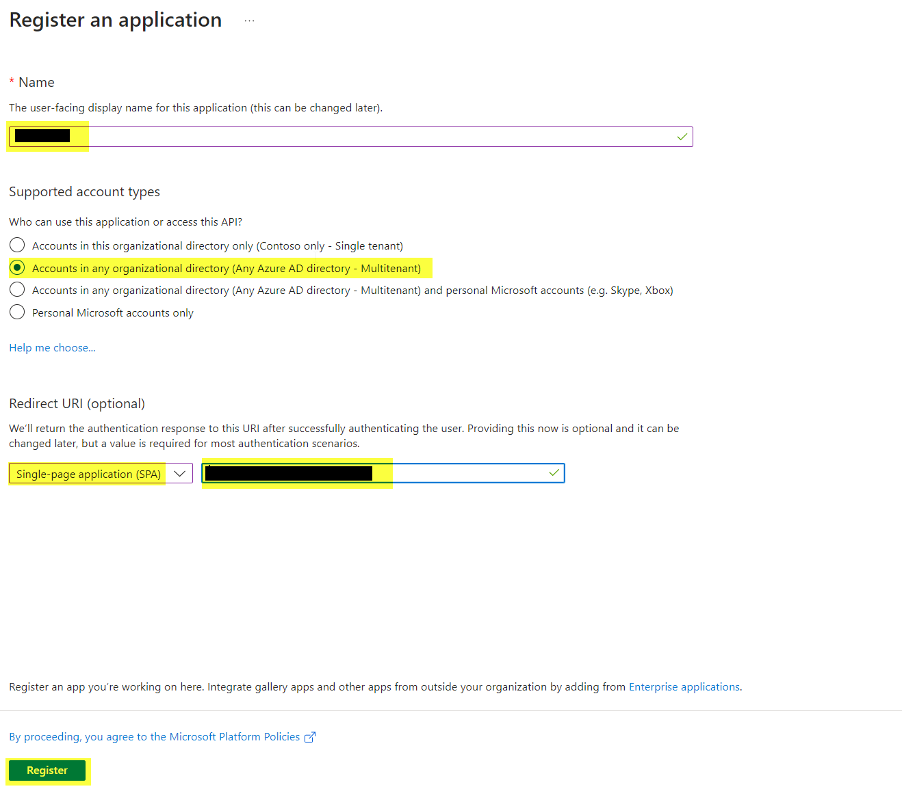

Edit the Registration:

### In Tab **Authentication**

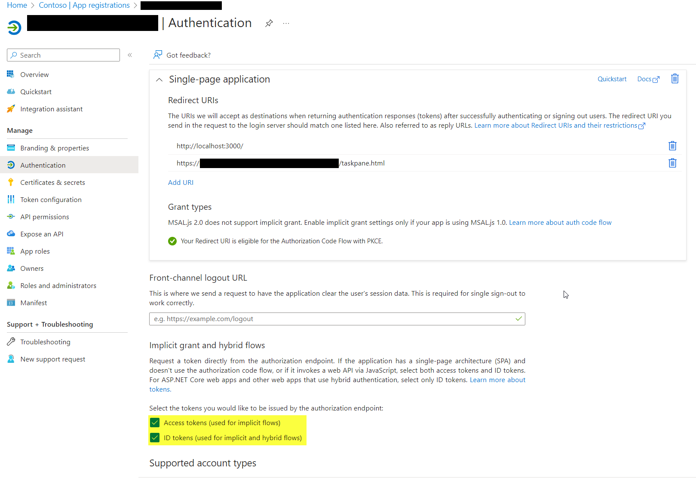

Check **Access tokens (used for implicit flows)**

Check **ID tokens (used for implicit and hybrid flows)**

### In Tab **API permission**

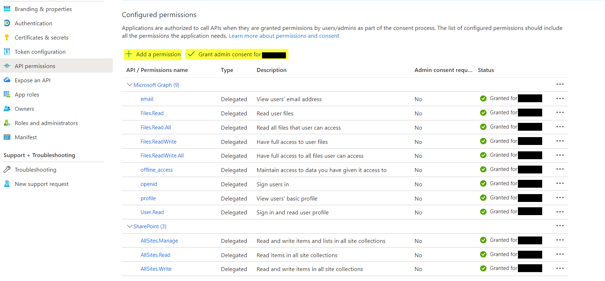

Add permission:

- Microsoft Graph

  - offline_access
  - openid
  - User.Read
  - profile
  - Files.Read.All
  - Files.ReadWrite.All

- SharePoint
  - AllSites.Manage
  - AllSites.Read
  - AllSites.Write

Click on **Grant admin consent for ....**

### In Tab **Expose an API**


Add a scope

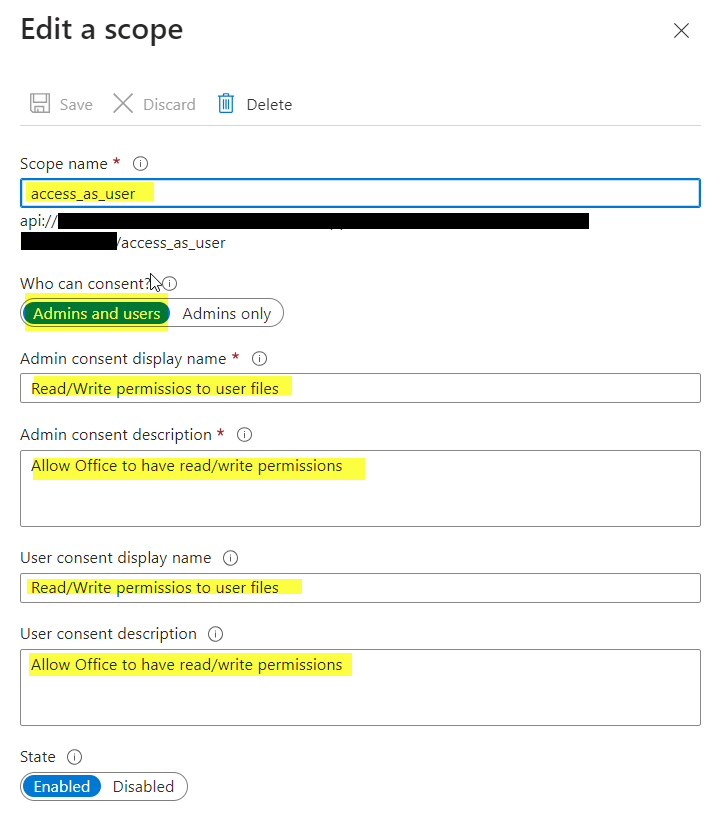

Name: **access_as_user**
Who can consent?: **Admins and users**
Textfields: Enter a Comment

Add a client application

This Client ID is the default ID for give office access, add this ID to the App Registration.

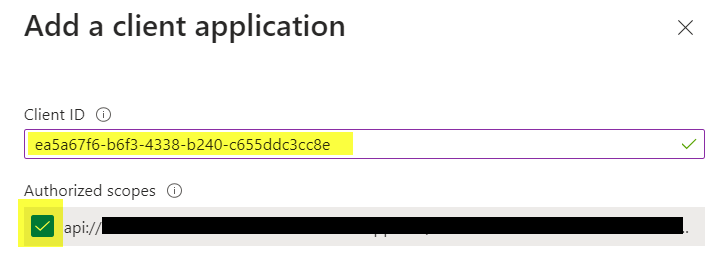

Client ID: **ea5a67f6-b6f3-4338-b240-c655ddc3cc8e**

Authorized scopes: **check**

## Demo Application

Navigate to: [App Registration](https://portal.azure.com/#view/Microsoft_AAD_IAM/ActiveDirectoryMenuBlade/~/RegisteredApps)

Choose your App Registration and Navigate to **Overview** and click on **Single-page application (SPA)**
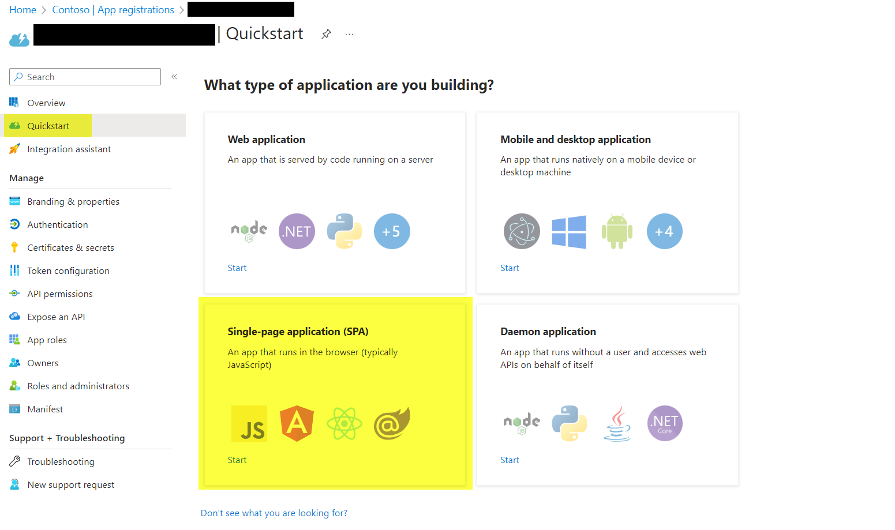

Choose your Framework, in my case is React
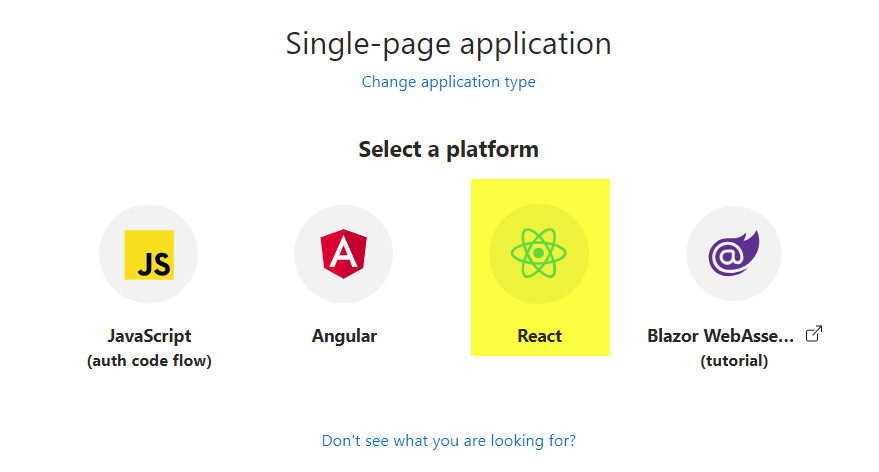

If Localhost for debugging not registerd in Authentication / Single-page application then click on **Make this changes for me**
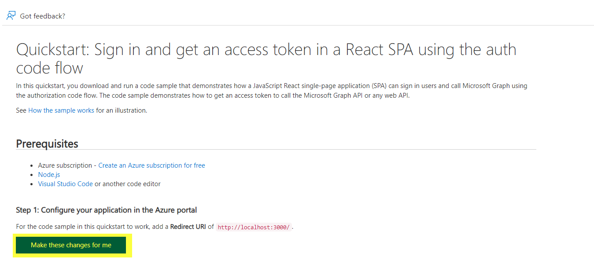

Download the Demo App package
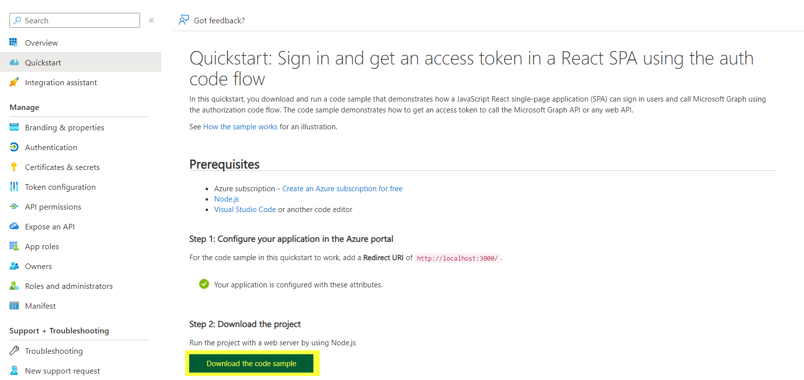

## Create Project

Install NodeJS 16.20

```powershell
npm install --global yo
npm install --global generator-office@1.9.7
npm i
```

Add WebApplication section after Resources node

```xml
    <WebApplicationInfo>
      <Id>[AppID]</Id>
      <Resource>api://[ServiceUrl]/[AppID]</Resource>
      <Scopes>
        <Scope>Files.Read.All</Scope>
        <Scope>offline_access</Scope>
        <Scope>openid</Scope>
        <Scope>profile</Scope>
      </Scopes>
    </WebApplicationInfo>
```

Add LoginOutButtons.tsx

```javascript
export const LoginOutButtons = () => {
  const isAuthenticated = useIsAuthenticated();
  const { instance } = useMsal();

  const handleLogin = () => {
    instance.loginPopup(loginRequest).catch((e) => {
      console.log(e);
    });
  };
  const handleLogout = () => {
    instance.logoutPopup({
      postLogoutRedirectUri: "/",
      mainWindowRedirectUri: "/",
    });
  };
  return isAuthenticated ? (
    <div>
      <DefaultButton
        iconProps={{ iconName: "SignOut" }}
        onClick={() => handleLogout()}
      >
        Sign OUT
      </DefaultButton>
    </div>
  ) : (
    <div>
      <DefaultButton
        iconProps={{ iconName: "Signin" }}
        onClick={() => handleLogin()}
      >
        Sign IN
      </DefaultButton>
    </div>
  );
};
```

Add following lines to index.tsx

```typescript
...
import { PublicClientApplication } from "@azure/msal-browser";
import { msalConfig } from "./authConfig";
import { MsalProvider } from "@azure/msal-react";

const msalInstance: PublicClientApplication = new PublicClientApplication(msalConfig);

...

<MsalProvider instance={msalInstance}>
    <Component title={title} isOfficeInitialized={isOfficeInitialized} />
</MsalProvider>
...
```

Add following lines to App.tsx

```typescript
import { MsalContext } from "@azure/msal-react";
import { AccountInfo, IPublicClientApplication, RedirectRequest } from "@azure/msal-browser";
...
const msalInstance: IPublicClientApplication = this.context.instance;
const msalAccounts: AccountInfo[] = this.context.accounts;
const msalIsAuthenticated: boolean = this.context.accounts && this.context.accounts.length > 0;

...

const url = new URL(Office.context.document.url);
const request: RedirectRequest = {
    account: accounts[0],
    scopes: [url.origin + "/.default"],
};

instance.acquireTokenSilent(request).then((response) => {
    fetch(url.origin + "/_api/web/allProperties", {
        method: "GET",
        headers: {
            Authorization: `Bearer ${response.accessToken}`,
            "Content-Type": "application/json",
            Accept: "application/json",
        },
    })
    .then((res) => res.json())
    .then((res) => {
...
    });
});
```

## Test in Word for Browser

```powershell
npm run start:web -- --document {url}
```

example:

```powershell
npm run start:web -- --document "https://m365x32525383.sharepoint.com/:w:/r/_layouts/15/Doc.aspx?sourcedoc=%7B3CC1D7E1-D465-4D25-97D6-14892CDF8D63%7D&file=Personal%20employees%20information.docx&action=default&mobileredirect=true"
```

Allow localhost loopback for Microsoft Edge Web Browser?: **No**

## Create Pakage

Create Pakage with command

```powershell
npm run build
```

This create the folder dist. Copy the content of this folder to a WebService.

## Service Debloyment with Azure Static Web App

As folder for the Azure Static Web App can be used a Git Repo folder in DevOps.

Navigate to the [Azure Portal](https://portal.azure.com/)

Create a ressource **Static Web App** in Categorie **Web**

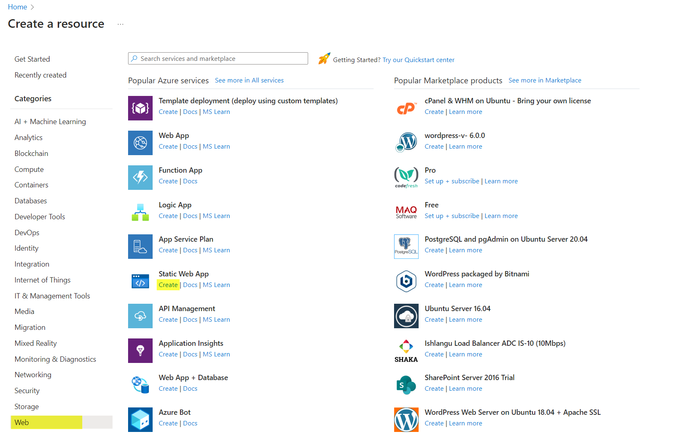

Select Source **Azure DevOps** and choose the right repo

Select **HTML** as build presets. the **App location** is the path in the Repo to the webservice directory.

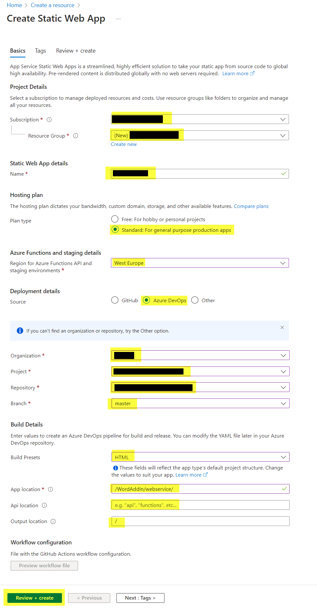

After create the App it generate a \*.yml file in the root folder of this repo. You can get it with pull the Git repo.

In YML File edit the section:

```
  app_location: "/[path to webservice file directory]" # App source code path
  api_location: "" # Api source code path - optional
  output_location: "/" # Built app content directory - optional
  skip_app_build: true
  action: 'upload'
```

The service need a index.html file in the root folder, you can create an empty file and add it to the webservice deployment folder.

Url from Static WebApp update in webpack.config.js in parameter **urlProd** used in manifest.xml as example: *https://brave-water-033784703.3.azurestaticapps.net/*

## Register Manifest

Edit the Manifest.xml in the dist folder. The Resource url in the WebApplicationInfo section is like **api://[WebService Url]/<Application ID>** as example: _api://brave-water-033784703.3.azurestaticapps.net/bbfb4a25-931c-41cb-b835-bf72f520375f_

The Manifest file define the new action and after upload the file the button is visible in Word.

Navigate to: [Admin Center](https://admin.microsoft.com/?source=applauncher#/Settings/IntegratedApps)

Click on **Upload custom apps**

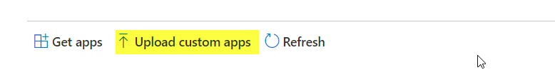

Choose **Office Add-in** and upload the manifest.xml file with **Choose File**

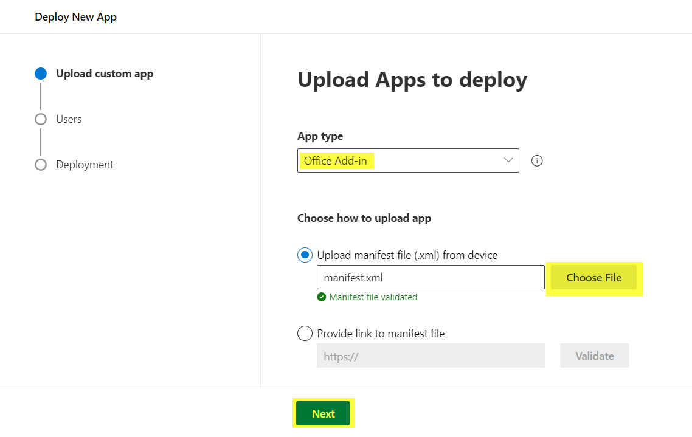

Choose **Entire organization**

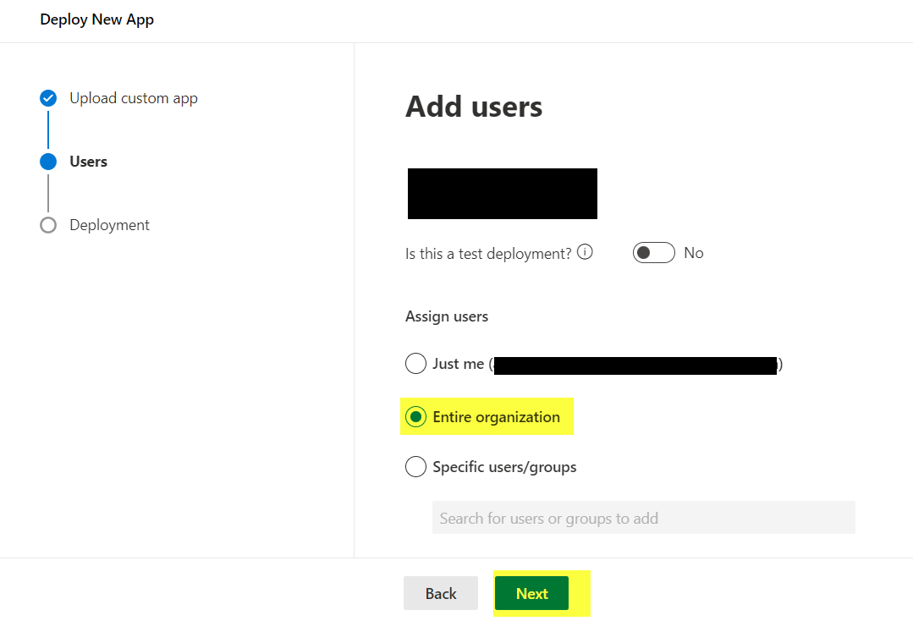

Click **Accept Permission**

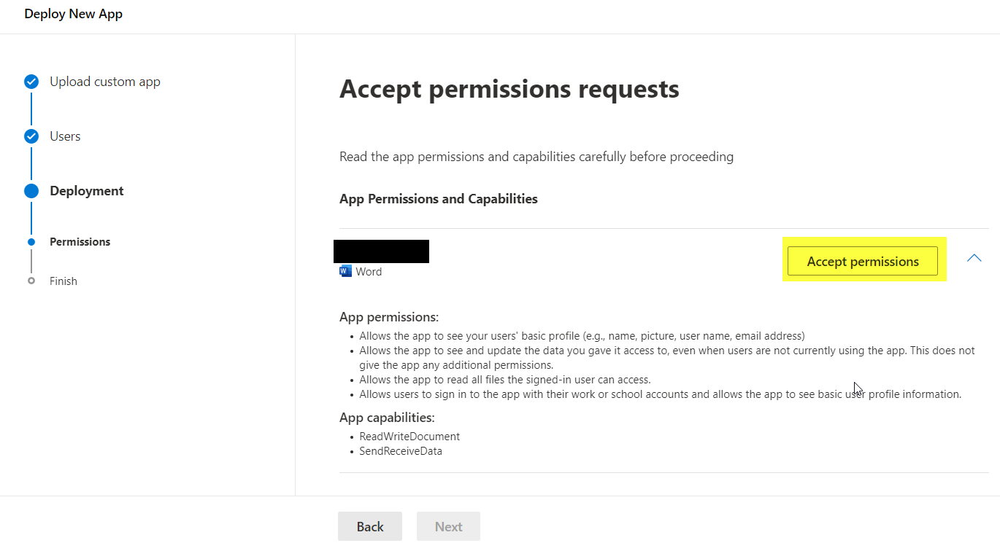

Click **Accept**

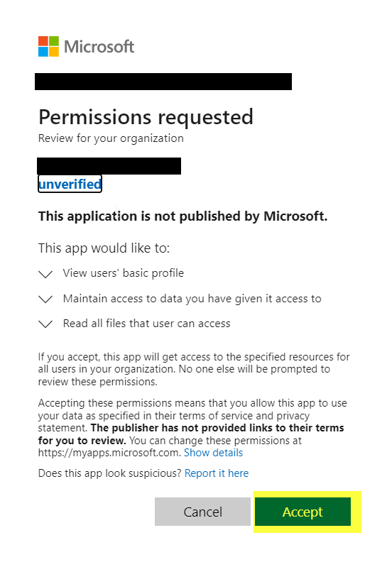

Click **Next**

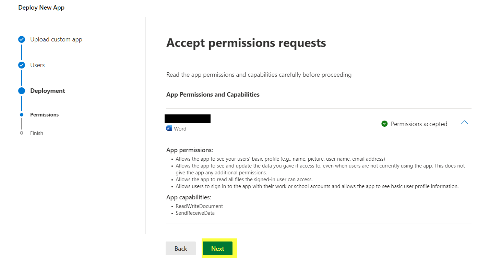

Click **Finish deployment**

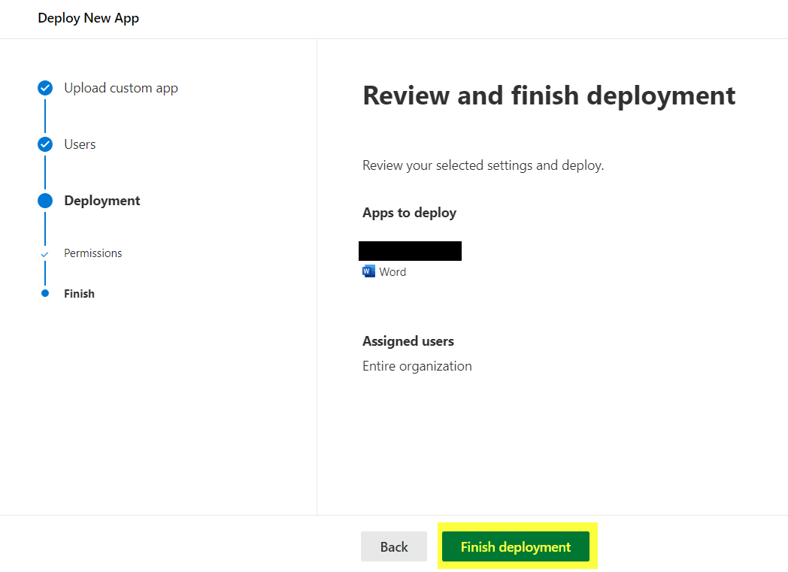

Click **Done**

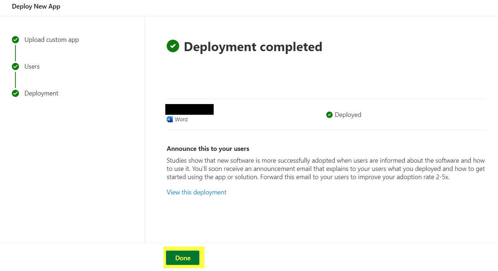
