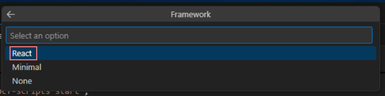

# Kusi's Knowledge Base

## Teams Toolkit Component Framework

### Learning

[Teams Toolkit Extension](https://marketplace.visualstudio.com/items?itemName=TeamsDevApp.ms-teams-vscode-extension)
[Teams Toolkit Fundamentals](https://learn.microsoft.com/en-us/microsoftteams/platform/toolkit/teams-toolkit-fundamentals)

### Prerequisits

Install [Visual Studio Code](https://code.visualstudio.com/download)

Download and Install [NVM Setup](https://github.com/coreybutler/nvm-windows/releases)

Open PowerShell as Administrator
  
Install the latest NodeJS

```powershell
nvm install 16.20.0
nvm use 16.20.0
```

Start Visual Studio Code and install Extension: **Teams Toolkit Extension**

Navigate the **Teams Toolkit** and click on **Run Prerequisite Checker** and if its done click in this Dialog on the bottom on **Mark Done**

Navigate the **Teams Toolkit** Add Account in section **Accounts**

### Create Project

Click on **Teams Toolkit** and **Create a new App** 


Select **Tab**


Select **SPFx**


Select **Install the latest SPFx**


Select **React**



Sign in in Tab **Accounts**


### Debug

Press **F5** 

### Build

In section **LIFECYCLE** it have 3 steps


**Provision** 

Create Teams App Package and make all initial entries in Teams App Store

**Deploy**

Create Teams App Package and make all initial entries in Teams App Store

**Publish**

Create Teams App Package and update it in Teams App Store
