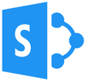
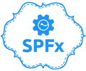
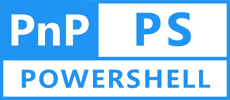
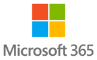

# Kusi's Knowledgebase

This blog is a collection of useful things that I need in everyday work from time to time and maybe can help someone else.

## SP2016/2019

[SharePoint](./onPrem/SP/index.md)

[SPFx](./onPrem/SPFx/index.md)

[PnP](./onPrem/PnP/index.md)

[PowerShell](./onPrem/PowerShell/index.md)

## React

[React](./React/index.md)

## Azure

[VMs](./Azure/VMs/index.md)

## Power Platform

[Power Platform](./PowerPlatform/index.md)

## M365

[SPFx](./M365/SPFx/index.md)

[PnP](./M365/PnP/index.md)

[PowerShell](./M365/PowerShell/index.md)
