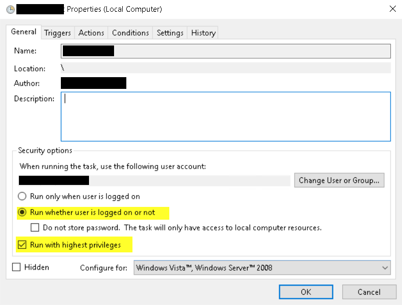
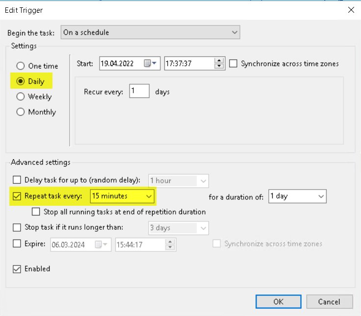
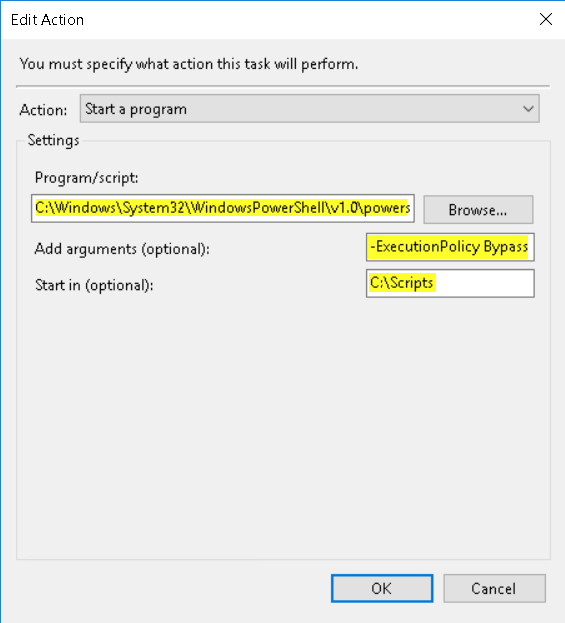

# Kusi's Knowledge Base

## OnPrem PowerShell

### Load SharePoint script

```powershell
Add-PSSnapin Microsoft.SharePoint.PowerShell -ErrorAction SilentlyContinue
```

### Update content database

```powershell
Get-SPContentDatabase |% { Upgrade-SPContentDatabase -Identity $_.Id -Confirm:$false }
```

### Update CA content database

```powershell
$wa = Get-SPWebApplication -IncludeCentralAdministration | Where { $_.DefaultServerComment -eq "SharePoint Central Administration v4"}
Get-SPContentDatabase -WebApplication $wa |% { Upgrade-SPContentDatabase -Identity $_.Id -Confirm:$false }
```

### New developer certificate

```powershell
Import-Module WebAdministration
Set-Location IIS:\SslBindings
New-WebBinding -Name "Default Web Site" -IP "*" -Port 443 -Protocol https
$c = New-SelfSignedCertificate -DnsName *.myexample.com,*.my.com -CertStoreLocation cert:\LocalMachine\My
```

Open mmc.exe and add Server Certificate

Copy New Certificate from Personal to Trusted Root Certifiaction Authorities

Open IIS and change the Binding Certificate

### Error: cannot be loaded because running scripts is disabled on this System

```powershell
Set-ExecutionPolicy -ExecutionPolicy Unrestricted
```

### Get all loaded assemblies in Powershell

```powershell
[System.AppDomain]::CurrentDomain.GetAssemblies() | Where-Object Location | Sort-Object -Property FullName | Select-Object -Property Name, Location, Version | Out-GridView
```

### Script as scheduled task

Select **Run whetever user is logged on or not** and **Run with highest privileges**



Add a Trigger with the repeating interval you want.



Add an Action with the values:

- Program/script: **C:\Windows\System32\WindowsPowerShell\v1.0\powershell.exe**
- Add arguments: **-ExecutionPolicy Bypass -File "[Path]\\[Scriptname].ps1"**
- Start in: **[Path]**


