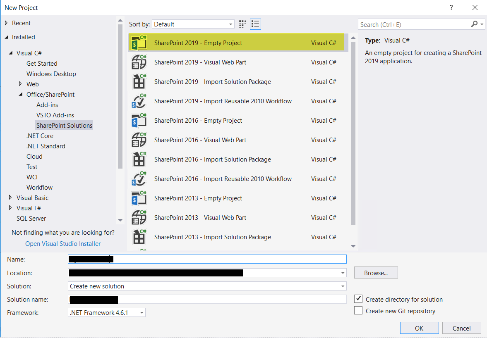
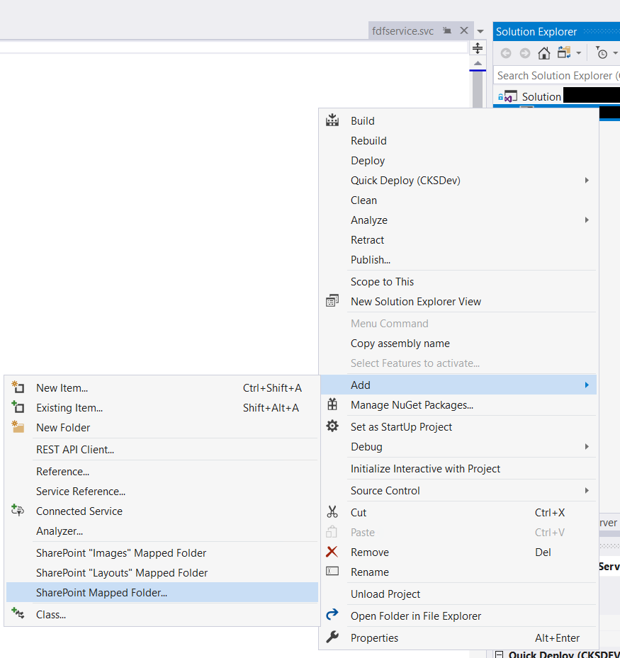
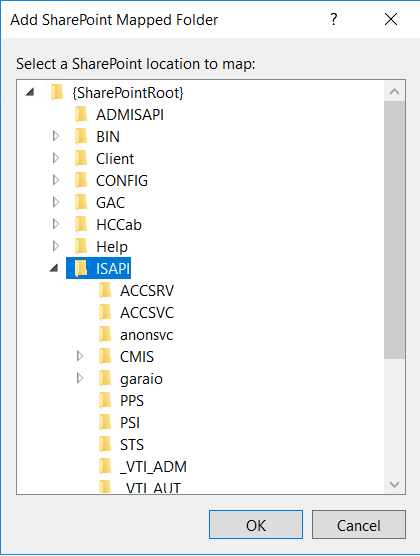

# Kusi's Knowledge Base

## SharePoint 2016 / 2019

### Close Connection to reconnect with another user

```url
https:<>/_layouts/closeConnection.aspx?loginasanotheruser=true
```

### App Launcher

```powershell
Enable-SPFeature -identity CustomTiles
```

Edit List on

```url
https:<>/Lists/Custom Tiles
```

### Mobile View

For a better mobile view feeling you can add in the Master Page in the Head Element.

```html
<meta name="viewport" content="width=device-width, initial-scale=1">
```

### WebService in WSP

Create a new Visual Studio Project **SharePoint Empty Project**



In the Solution Explorer on the Project right click an choose **Add...** and then **Mapped Folder**



select the **ISAPI** Folder



> IMPORTANT: take all folders and file names in lower case, otherwise the service will not working.

Add a Project folder and then 3 files and add it to the Projectfolder in the ISAPI Folder.

Create a file [servicename].svc with following content:

```xml
<%@ ServiceHost Language="C#" Debug="true"
    Service="[ServicenameInclNamespace], $SharePoint.Project.AssemblyFullName$"
    CodeBehind="[servicename].svc.cs"
    Factory="Microsoft.SharePoint.Client.Services.MultipleBaseAddressWebServiceHostFactory,
    Microsoft.SharePoint.Client.ServerRuntime, Version=16.0.0.0, Culture=neutral,
    PublicKeyToken=71e9bce111e9429c" %>
```

Create a file [servicename].svc.cs with following content:

```cs
namespace [Namespace]
{
    class [ServiceName] : [InterfaceServiceName]
    {
        public string [FunctionName](string prop)
        {
        }
    }
}
```

Create a file I[Servicename].cs with following content:

```cs
using System.ServiceModel;
using System.ServiceModel.Web;

namespace [Namespace]
{
    [ServiceContract]
    interface [IntefaceServiceName]
    {
        [OperationContract]
        [WebGet(UriTemplate = "[ServiceFunctionName]/{prop}",
            ResponseFormat = WebMessageFormat.Json)]
        string [FunctionName](string prop);
    }
}
```
