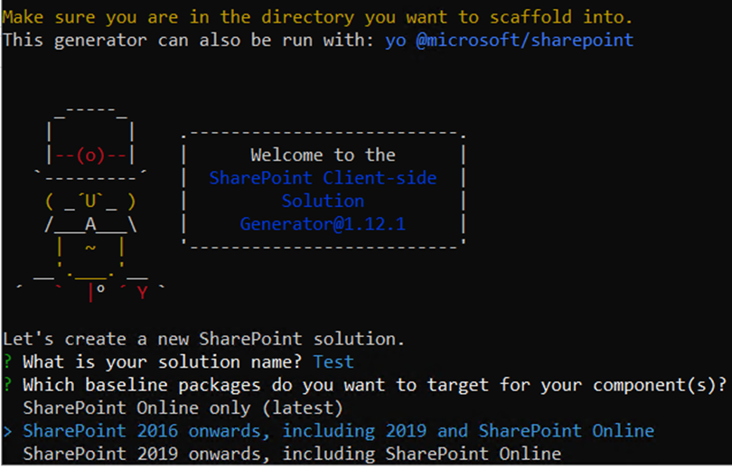

# Kusi's SPFx Knowledgebase

## Create a new project

### Create the project structure

A new project can be created with the Yeoman or another WebPart can be added to an existing project in the same way.

Switch to the project folder in Powershell and call it up. Then select &#64;microsoft/sharepoint as generator.


Enter a project name and then select for which SharePoint version a WebPart would like to be developed.



Choose whether to create the project in the current folder or in a subfolder.


After that you will be asked if you want to publish this package to all sites without «Add app». (SP2019, online)

After that you will be asked if this package needs rights to access web APIs. (On-line)


After that you will be asked what you want to create, the following is your choice.

#### WebPart (SP2016, SP2019, Online)

These WebParts are available in both Classic and Modern design.

```remark
Tip: There shouldn't be more than 10 WebParts in a package, because the creation gets slower and slower and from 10 it gets noticeably slower and makes debugging a bit more cumbersome. In business it doesn't matter.
```

#### Extension (SP2019, Online)

With Extension, components in Modern Page can be placed at predefined zones such as headers or footers. For example, you can render your own navigation or footer on all Modern Sites.

#### Library (Online)

The Library option is available online, with which only released code can be referenced.

### Build project

The developer certificate must be installed for the first time:

```powershell
gulp trust-dev-cert
```

If something went wrong with the installation of the developer certificate, this can be reversed and then installed again:

```powershell
gulp untrust-dev-cert
gulp trust-dev-cert
```

A package can be created with the following commands:

Debug:

```powershell
gulp clean
gulp bundle
gulp package-solution
```

Release:

```powershell
gulp clean
gulp bundle --ship
gulp package-solution --ship
```

The package is then available under the <b>&lt;Project path&gt;</b>\sharepoint\solution folder.

### Debug project

A service is started locally with the following command:

```powershell
gulp serve --nobrowser
```

Depending on the language, debugging can be done with locale:

```powershell
gulp serve –-nobrowser --locale de-de
```

The current version of the directory under which the command was called is then available under the workbench link <b>/_layouts/15/workbench.aspx</b>. The workbench link can be appended behind any site url e.g.: [https://mysp.microsoft.com/sites/News/_layouts/15/workbench.aspx](https://mysp.microsoft.com/sites/News/_layouts/15/workbench.aspx) in this example all lists, fields etc. are available to you which available at web [https://mysp.microsoft.com/sites/News](https://mysp.microsoft.com/sites/News), but the code is the local unminified code.

### Create App Catalog

If there is still no AppCatalog for the existing WebApplication, this can be created in the Central Admin under Apps by selecting the WebApplication and clicking "Create a new app catalog site".


### Publish

The package can then be uploaded to the AppCatalog under "Apps for SharePoint".


The package is then available as an installable app for all site collections and can be installed using «Add app».

#### SP2016

With SP2016, the JavaScript files are still outside of the package, so a DocLib must be provided where the JS files can be stored. The App Catalog site is ideally suited, under which a DocLib can be created, e.g. with the name CDN, where a subfolder can then be created for each package, for example, to which the files can then be uploaded from the path: <b>&lt;Project path&gt;/temp/deploy</b>. So that SPFx can link to the correct folder, the cdnBasePath must be defined in the <b>&lt;Project path&gt;/config/write-manifests.json</b> file, e.g. <b>/sites/appcatalog/cdn/myproject</b>. The package can be found under <b>&lt;Project path&gt;/sharepoint/solution</b>.

#### SP2019

From SP2019 the JavaScript files are included in the package. The package can be found under <b>&lt;Project path&gt;/sharepoint/solution</b>.

### Navigation

[Introduction](intro.md)

[Development environment](devenv.md)

[Create a new project](createProject.md)

[Project structure](projectStructure.md)

[Migrate SPFx 2016 to 2019](migrate16to19.md)
