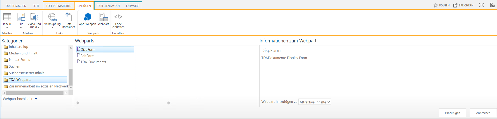
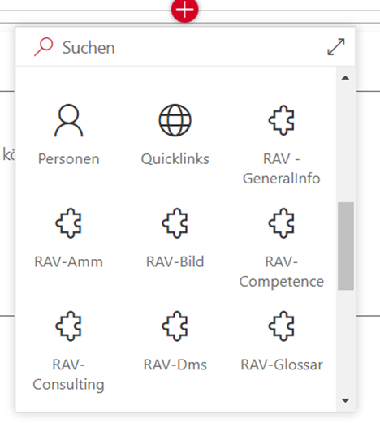

# Kusi's SPFx Knowledgebase

## Project structure

### Package configuration

#### Package Solution

<pre><code>Path: &lt;Projectpath&gt;/config/package-solution.json</code></pre>

The name and the name of the file can be adjusted in the package-solution.json file. The version can also be defined.

### Package

<pre><code>Path: &lt;Projectpath&gt;/package.json</code></pre>

The package.json file also has the version, it should be the same as the version above.

Additional modules that can be used in the package can be entered in the dependencies section. The same can be achieved with:

```powershell
npm <modulename> --install –save
```

In the devDependencies section, additional modules can be entered that are only used for development and should not be compiled into the package. The same can be achieved with:

```powershell
npm <modulename> --install --save-dev
```

If the packages were added manually in the package.json file, the packages can be downloaded with the following command:

```powershell
npm -i
```

### Gulpfile

<pre><code>Path: &lt;Projectpath&gt;/gulpfile.js</code></pre>

So that the package can be created directly using gulp dist, gulp-sequence must first be installed:

```powershell
npm install gulp-sequence@^1.0.0 --save-dev
```

```powershell
'use strict';

if (process.argv.indexOf('dist') !== -1){
    process.argv.push('--ship');
}

const gulp = require('gulp');
const build = require('@microsoft/sp-build-web');
const gulpSequence = require('gulp-sequence');

build.addSuppression(`Warning - [sass] The local CSS class 'ms-Grid' is not camelCase and will not be type-safe.`);

gulp.task('dist', gulpSequence('clean', 'bundle', 'package-solution'));

build.initialize(gulp);
```

Under SP2019 there was the problem that the package got bigger with each build. It is therefore advisable to delete the old temp files there:

```powershell
'use strict';

if (process.argv.indexOf('dist') !== -1){
    process.argv.push('--ship');
}

const gulp = require('gulp');
const build = require('@microsoft/sp-build-web');
const gulpSequence = require('gulp-sequence');
const del = require('del');

gulp.task('cleanup', function(){
     return del(['dist/**','lib/**','release/**','sharepoint/**','temp/**'], {force:true});
});

build.addSuppression(`Warning - [sass] The local CSS class 'ms-Grid' is not camelCase and will not be type-safe.`);

gulp.task('dist', gulpSequence('clean', 'cleanup', 'bundle', 'package-solution'));

build.initialize(gulp);
```

The release package can then be created using the following command:

```powershell
gulp dist
```

### WebPart

#### Manifest

<pre><code>Path: &lt;Projectpath&gt;/webparts/&lt;WebPartName&gt;/&lt;WebPartName&gt;WebPart.manifest.json</code></pre>

The groupid value can be a new GUID and given a name in the group value. This name is then used as a category in the classic design.



With the value officeFabricIconFontName the icon can be defined in modern design.



#### Styling

<pre><code>Path: &lt;Projectpath&gt;/webparts/&lt;WebPartName&gt;/components/&lt;WebPartName&gt;.module.scss</code></pre>

The styles can be defined in this file, they can be nested and then converted into a correct CSS when compiling. The name can then be accessed using styles.&lt;Name&gt;. Global CSS classes can be defined using global keyword.

Example:

```js
:global(#spPageCanvasContent .CanvasZone) {
  max-width: unset;
}
```

#### Interfaces

<pre><code>Path: &lt;Projectpath&gt;/webparts/&lt;WebPartName&gt;/components/I&lt;WebPartName&gt;.ts</code></pre>

This file contains the interfaces for this WebPart.

Example:

```js
export interface I<WebPartName>State {
    error?: undefined;
    isLoaded?: boolean;
    items?: IItem[];
    selectedItem?: IItem;
}
export interface IItem {
    ID: number;
    Title: string;
}
```

#### Properties

<pre><code>Path: &lt;Projectpath&gt;/webparts/&lt;WebPartName&gt;/components/I&lt;WebPartName&gt;Props.ts</code></pre>

Props contains global variables and properties from the settings panel
Example:

```js
import { SPHttpClient } from '@microsoft/sp-http';

export interface I<WebPartName>Props {
  siteurl: string;
  spHttpClient: SPHttpClient;
}
```

#### Init file

<pre><code>Path: &lt;Projectpath&gt;/webparts/&lt;WebPartName&gt;/&lt;WebPartName&gt;WebPart.ts</code></pre>

The global values of props are defined here
Example:

```js
  public render(): void {
    const element: React.ReactElement<I<WebPartName>Props > = React.createElement(
      <WebPartName>,
      {
        siteurl: this.context.pageContext.web.absoluteUrl,
        spHttpClient: this.context.spHttpClient
      }
    );
    ReactDom.render(element, this.domElement);
  }
```

#### Code

<pre><code>Path: &lt;Projectpath&gt;/webparts/&lt;WebPartName&gt;/components/I&lt;WebPartName&gt;.tsx</code></pre>

Example:

```js
import * as React from 'react';
import styles from './<WebPartName>.module.scss';
import { I<WebPartName>Props } from './I<WebPartName>Props';
import { SPHttpClient } from '@microsoft/sp-http';
import { Spinner, SpinnerSize } from 'office-ui-fabric-react';
import { I<WebPartName>State, IItem } from './I<WebPartName>';

export default class <WebPartName> extends React.Component<I<WebPartName>Props, I<WebPartName>State> {
  public constructor(props: I<WebPartName>Props) {
    super(props);
    this.state = {
      error: undefined,
      isLoaded: false,
      items: [],
      selectedItem: undefined
    };
  }

  public componentDidMount(): void {
    let items: IItem[] = [];
    this.props.spHttpClient.get(`${this.props.siteurl}/_api/web/lists/getbytitle('<ListName>')/Items` +
      `?$select=Id,Title`,
      SPHttpClient.configurations.v1)
      .then(resType => resType.json())
      .then(resType => {
        if (resType.value) {
          items = resType.value;
        }

        this.setState({
          items: items,
          isLoaded: true
        });
      });
  }

  public render(): React.ReactElement<IKnowledgeBaseProps> {
    const { items, selectedItem, error, isLoaded } = this.state;
    let retValue: JSX.Element = <div>{strings.NoData}</div>;
    if (error) {
      retValue = <div className={styles.error}>{strings.Error}: {error}</div>;
    } else if (!isLoaded) {
      if (SpinnerSize && SpinnerSize.large) {
        retValue = <div className={styles.loadingWrapper}>
          <Spinner size={SpinnerSize.large} label={strings.OnLoading} />
        </div>;
      } else {
        retValue = <div>{strings.OnLoading}</div>;
      }
    } else if (selectedItem) {
      retValue = <div className={styles.container}>
        <div className={styles.grouptext}>{selectedItem.Title}</div>
      </div>;
    } else {
      retValue = <div className={styles.container}>{items.map(g =>
          <div><div className={styles.grouptext}>{g.Title}</div></div>
        )}
      </div>;
    }
    return (
      <div className={styles.KnowledgeBase}>{retValue}</div>
    );
  }
}
```
